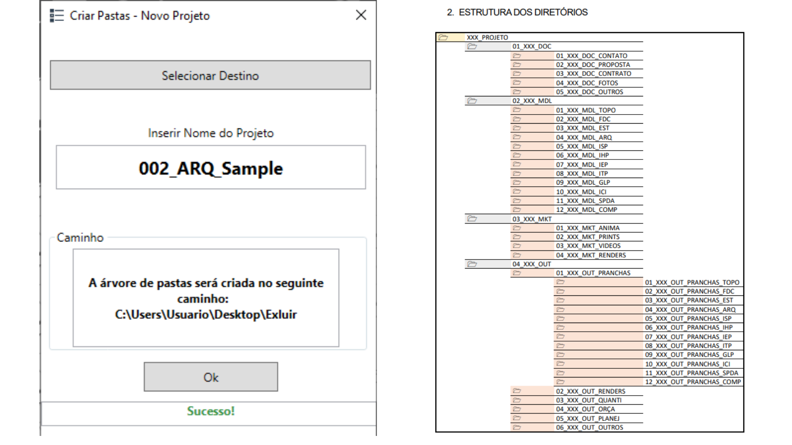
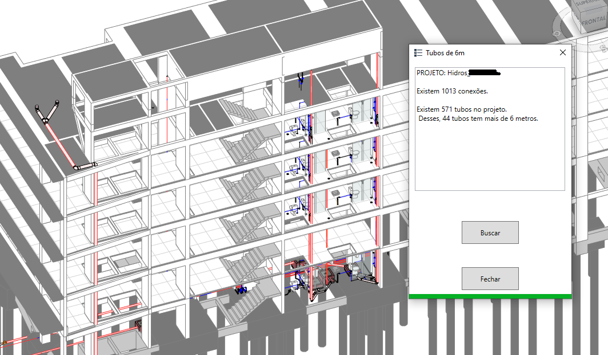

# pyEscora

PyRevit extension tab with 2 functionalities:
-   File structure generator. With simple click it will create entire folders structure tree with project code and name, resulting in organized files e quicker search later on;
-   MEP elements filter greater than 6 meters;

## Screenshots

